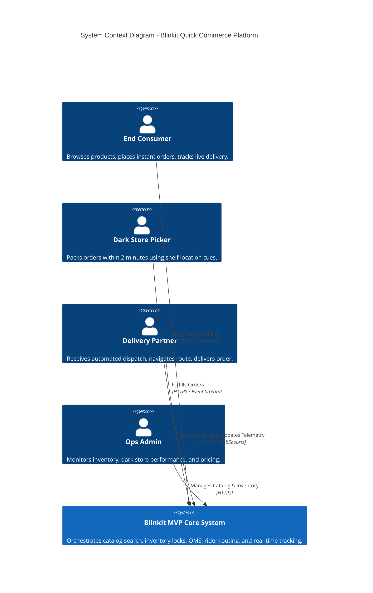
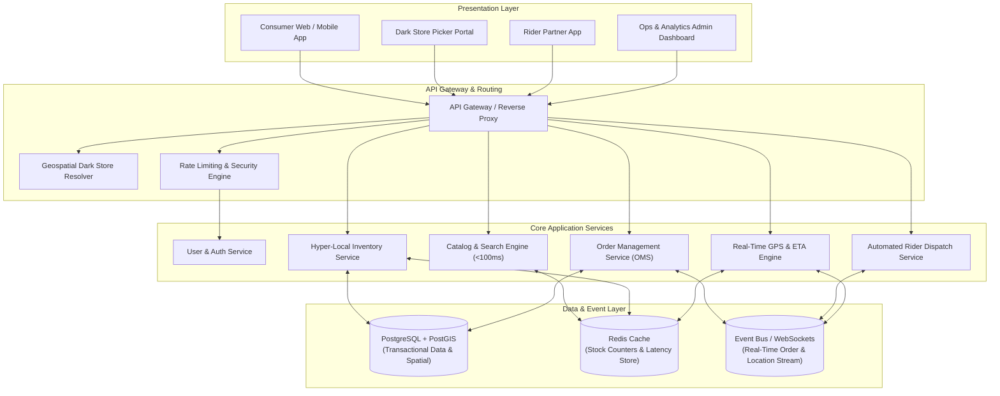
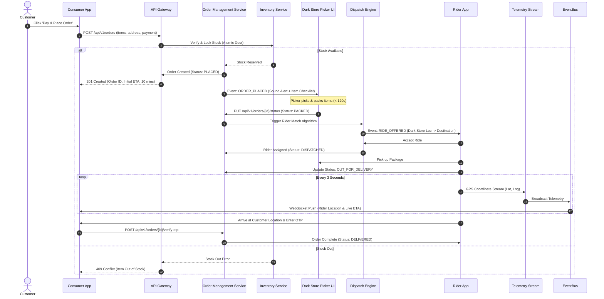
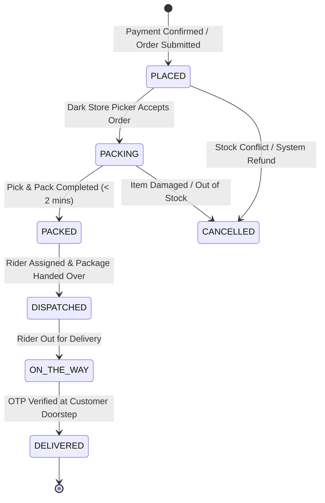
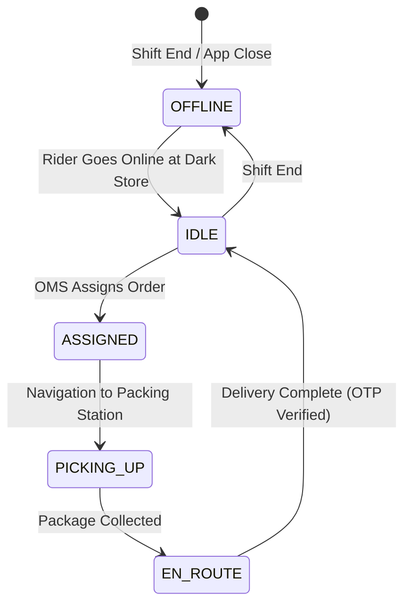

# Technical Architecture Specification: Blinkit MVP (Quick Commerce Platform)

## 1. Architectural Overview & Design Principles

The **Blinkit Quick Commerce MVP** is designed around low-latency, event-driven microservices and hyper-local spatial routing. The primary goal is achieving sub-10-minute order fulfillment through end-to-end integration between consumer frontend interfaces, micro-fulfillment Dark Stores, and real-time delivery rider tracking.



### Core Architectural Principles
1. **Hyper-Local Geofencing First**: Every incoming request is scoped to a specific Dark Store ID using geospatial coordinates (2–3 km radius polygon matching).
2. **Atomic Inventory Reservation**: Concurrency control prevents overselling during peak traffic spikes using atomic decrement operations.
3. **Event-Driven Order Lifecycle**: Asynchronous state machine transitions decouple order placement from notification dispatches and telemetry streaming.
4. **Resilient Local-First UI State**: Consumer cart and order progress state are cached locally to ensure high responsiveness and graceful network degradation.

---

## 2. System Architecture Layers



---

## 3. Order Lifecycle & Data Flow Sequence

The diagram below illustrates the exact sequence from customer checkout to final delivery handover.



---

## 4. Database Schema & Data Models

### 4.1 ER Diagram Overview

```mermaid
erDiagram
    USERS ||--o{ USER_ADDRESSES : has
    USERS ||--o{ ORDERS : places
    DARK_STORES ||--o{ DARK_STORE_INVENTORY : manages
    DARK_STORES ||--o{ ORDERS : fulfills
    CATEGORIES ||--o{ PRODUCTS : categorizes
    PRODUCTS ||--o{ DARK_STORE_INVENTORY : stocked_in
    PRODUCTS ||--o{ ORDER_ITEMS : contains
    ORDERS ||--|{ ORDER_ITEMS : includes
    RIDERS ||--o{ ORDERS : delivers
    ORDERS ||--o1 DELIVERIES : tracks
```

### 4.2 Relational Table Definitions (DDL)

```sql
-- 1. Users Table
CREATE TABLE users (
    id UUID PRIMARY KEY DEFAULT gen_random_uuid(),
    full_name VARCHAR(100) NOT NULL,
    phone_number VARCHAR(15) UNIQUE NOT NULL,
    email VARCHAR(150),
    created_at TIMESTAMP WITH TIME ZONE DEFAULT CURRENT_TIMESTAMP
);

-- 2. User Addresses Table
CREATE TABLE user_addresses (
    id UUID PRIMARY KEY DEFAULT gen_random_uuid(),
    user_id UUID REFERENCES users(id) ON DELETE CASCADE,
    address_label VARCHAR(50) DEFAULT 'Home', -- Home, Work, Other
    street_address TEXT NOT NULL,
    landmark VARCHAR(100),
    latitude DECIMAL(10, 8) NOT NULL,
    longitude DECIMAL(11, 8) NOT NULL,
    location GEOGRAPHY(POINT, 4326) NOT NULL,
    is_default BOOLEAN DEFAULT false
);

-- 3. Dark Stores Table (Micro-fulfillment Hubs)
CREATE TABLE dark_stores (
    id UUID PRIMARY KEY DEFAULT gen_random_uuid(),
    store_code VARCHAR(20) UNIQUE NOT NULL, -- e.g. DS-IND-104
    name VARCHAR(100) NOT NULL,
    address TEXT NOT NULL,
    latitude DECIMAL(10, 8) NOT NULL,
    longitude DECIMAL(11, 8) NOT NULL,
    service_radius_km DECIMAL(3, 2) DEFAULT 2.50,
    service_polygon GEOGRAPHY(POLYGON, 4326),
    is_active BOOLEAN DEFAULT true,
    created_at TIMESTAMP WITH TIME ZONE DEFAULT CURRENT_TIMESTAMP
);

-- 4. Product Categories
CREATE TABLE categories (
    id UUID PRIMARY KEY DEFAULT gen_random_uuid(),
    name VARCHAR(100) NOT NULL,
    slug VARCHAR(100) UNIQUE NOT NULL,
    icon_url TEXT,
    display_order INT DEFAULT 0
);

-- 5. Products Catalog
CREATE TABLE products (
    id UUID PRIMARY KEY DEFAULT gen_random_uuid(),
    category_id UUID REFERENCES categories(id),
    title VARCHAR(150) NOT NULL,
    unit VARCHAR(50) NOT NULL, -- e.g., '500g', '1 Pack', '1 Liter'
    mrp_price DECIMAL(10, 2) NOT NULL,
    discounted_price DECIMAL(10, 2) NOT NULL,
    image_url TEXT NOT NULL,
    shelf_life_days INT,
    tags TEXT[], -- e.g. ['fresh', 'organic', 'breakfast']
    created_at TIMESTAMP WITH TIME ZONE DEFAULT CURRENT_TIMESTAMP
);

-- 6. Dark Store Inventory (Hyper-local Stock mapping)
CREATE TABLE dark_store_inventory (
    id UUID PRIMARY KEY DEFAULT gen_random_uuid(),
    dark_store_id UUID REFERENCES dark_stores(id) ON DELETE CASCADE,
    product_id UUID REFERENCES products(id) ON DELETE CASCADE,
    stock_quantity INT NOT NULL DEFAULT 0,
    rack_location VARCHAR(20) NOT NULL, -- e.g. 'Aisle 3, Shelf B2'
    is_available BOOLEAN DEFAULT true,
    UNIQUE(dark_store_id, product_id)
);

-- 7. Orders Table
CREATE TABLE orders (
    id UUID PRIMARY KEY DEFAULT gen_random_uuid(),
    order_number VARCHAR(30) UNIQUE NOT NULL,
    user_id UUID REFERENCES users(id),
    dark_store_id UUID REFERENCES dark_stores(id),
    rider_id UUID REFERENCES riders(id),
    item_total DECIMAL(10, 2) NOT NULL,
    delivery_fee DECIMAL(10, 2) DEFAULT 0.00,
    surge_fee DECIMAL(10, 2) DEFAULT 0.00,
    total_amount DECIMAL(10, 2) NOT NULL,
    payment_status VARCHAR(20) DEFAULT 'PENDING', -- PENDING, PAID, FAILED
    order_status VARCHAR(30) DEFAULT 'PLACED', -- PLACED, PACKING, DISPATCHED, ON_THE_WAY, DELIVERED, CANCELLED
    delivery_address TEXT NOT NULL,
    delivery_latitude DECIMAL(10, 8) NOT NULL,
    delivery_longitude DECIMAL(11, 8) NOT NULL,
    delivery_otp VARCHAR(4) NOT NULL,
    created_at TIMESTAMP WITH TIME ZONE DEFAULT CURRENT_TIMESTAMP
);

-- 8. Order Items Breakdown
CREATE TABLE order_items (
    id UUID PRIMARY KEY DEFAULT gen_random_uuid(),
    order_id UUID REFERENCES orders(id) ON DELETE CASCADE,
    product_id UUID REFERENCES products(id),
    product_title VARCHAR(150) NOT NULL,
    unit_price DECIMAL(10, 2) NOT NULL,
    quantity INT NOT NULL,
    total_price DECIMAL(10, 2) NOT NULL
);

-- 9. Delivery Partners (Riders)
CREATE TABLE riders (
    id UUID PRIMARY KEY DEFAULT gen_random_uuid(),
    full_name VARCHAR(100) NOT NULL,
    phone_number VARCHAR(15) UNIQUE NOT NULL,
    vehicle_number VARCHAR(20) NOT NULL,
    dark_store_id UUID REFERENCES dark_stores(id),
    status VARCHAR(20) DEFAULT 'OFFLINE', -- OFFLINE, IDLE, ASSIGNED, ON_THE_WAY
    current_latitude DECIMAL(10, 8),
    current_longitude DECIMAL(11, 8),
    updated_at TIMESTAMP WITH TIME ZONE DEFAULT CURRENT_TIMESTAMP
);
```

---

## 5. State Machine Specifications

### 5.1 Order State Machine



### 5.2 Rider State Machine



---

## 6. API Interface Specifications

### 6.1 Consumer REST API Endpoints

| Method | Endpoint | Description | Request Payload Summary | Response |
| :--- | :--- | :--- | :--- | :--- |
| `POST` | `/api/v1/location/detect` | Resolve nearest dark store | `{ lat: float, lng: float }` | `{ dark_store_id, eta_mins, is_serviceable }` |
| `GET` | `/api/v1/categories` | Fetch category taxonomy | None | `[{ id, name, icon_url, slug }]` |
| `GET` | `/api/v1/products` | Get products for dark store | query `dark_store_id, category_id, search` | `[{ id, title, price, stock_qty, rack_loc }]` |
| `POST` | `/api/v1/cart/checkout` | Validate cart & lock stock | `{ dark_store_id, items: [{id, qty}] }` | `{ valid: bool, subtotal, surge_fee, delivery_fee }` |
| `POST` | `/api/v1/orders` | Place new order | `{ user_id, dark_store_id, items, address_id }` | `{ order_id, order_number, status, otp, eta }` |
| `GET` | `/api/v1/orders/{id}/track` | Get live tracking details | Path param `id` | `{ status, rider_name, rider_phone, lat, lng, eta }` |

### 6.2 Real-Time WebSocket Protocol

**Endpoint**: `ws://<host>/ws/v1/orders/{order_id}/live-track`

**Payload (Rider Telemetry Stream - Server to Consumer Client)**:
```json
{
  "event": "TELEMETRY_UPDATE",
  "order_id": "8f3b2a11-09cd-4e2b-91d4-28b9c71a39f0",
  "order_status": "ON_THE_WAY",
  "rider": {
    "name": "Ramesh Kumar",
    "phone": "+919876543210",
    "location": {
      "latitude": 12.971598,
      "longitude": 77.594566
    }
  },
  "eta_seconds": 280,
  "timestamp": "2026-08-01T23:30:00Z"
}
```

---

## 7. Frontend Architecture & Design Tokens

### 7.1 Design Tokens (`index.css`)
```css
:root {
  /* Brand Color Palette */
  --color-brand-primary: #0c831f;       /* Blinkit Signature Green */
  --color-brand-primary-hover: #096818;
  --color-brand-accent: #f8cb46;        /* Bright Yellow Accent */
  --color-brand-express: #ff5722;       /* Express 10-Min Badge */

  /* Neutral & Dark Surface Colors */
  --color-bg-light: #f4f6f8;
  --color-surface-light: #ffffff;
  --color-bg-dark: #121212;
  --color-surface-dark: #1e1e1e;
  --color-border-subtle: #e2e8f0;

  /* Typography */
  --font-family-base: 'Inter', -apple-system, BlinkMacSystemFont, 'Segoe UI', Roboto, sans-serif;
  --font-size-xs: 0.75rem;
  --font-size-sm: 0.875rem;
  --font-size-md: 1.0rem;
  --font-size-lg: 1.25rem;
  --font-size-xl: 1.75rem;

  /* Layout & Elevations */
  --radius-sm: 6px;
  --radius-md: 12px;
  --radius-lg: 20px;
  --shadow-card: 0 4px 12px rgba(0, 0, 0, 0.05);
  --shadow-floating: 0 10px 25px rgba(0, 0, 0, 0.15);
  --transition-fast: all 0.2s cubic-bezier(0.4, 0, 0.2, 1);
}
```

---

## 8. Scalability, Concurrency & Security Controls

1. **High Concurrency Flash-Sale Defense**:
   - Redis `DECRBY` atomic scripts handle stock deductions to eliminate race conditions under peak traffic.
   - Redis fallback queues buffer order creation payloads during database lock contention.
2. **Offline-Resilient Telemetry**:
   - Rider application buffers GPS breadcrumbs locally in IndexedDB/AsyncStorage when encountering mobile network coverage gaps, re-flushing upon reconnection.
3. **Security Standards**:
   - **JWT Auth & Role-Based Access Control (RBAC)**: Distinct permissions for Consumers, Dark Store Pickers, Riders, and Admins.
   - **Order OTP Verification**: 4-digit cryptographically generated single-use OTP required for order completion.
