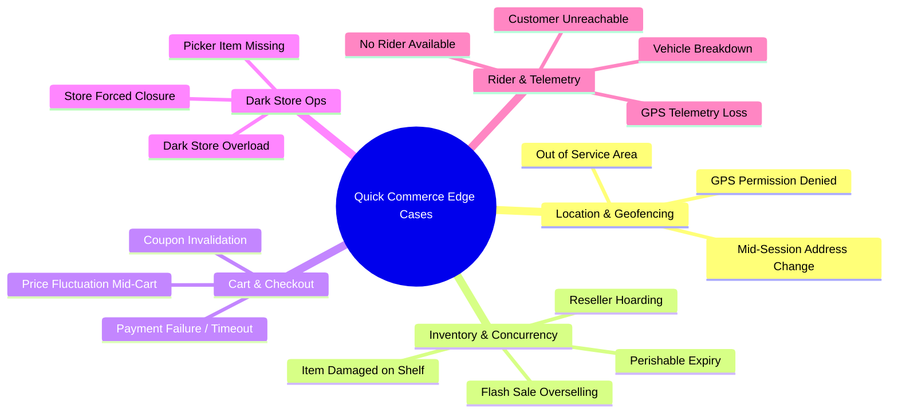
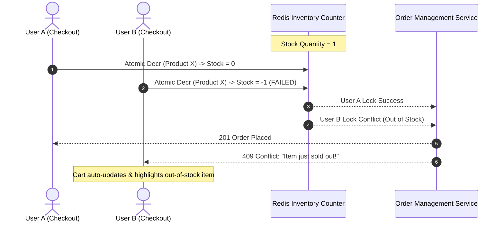
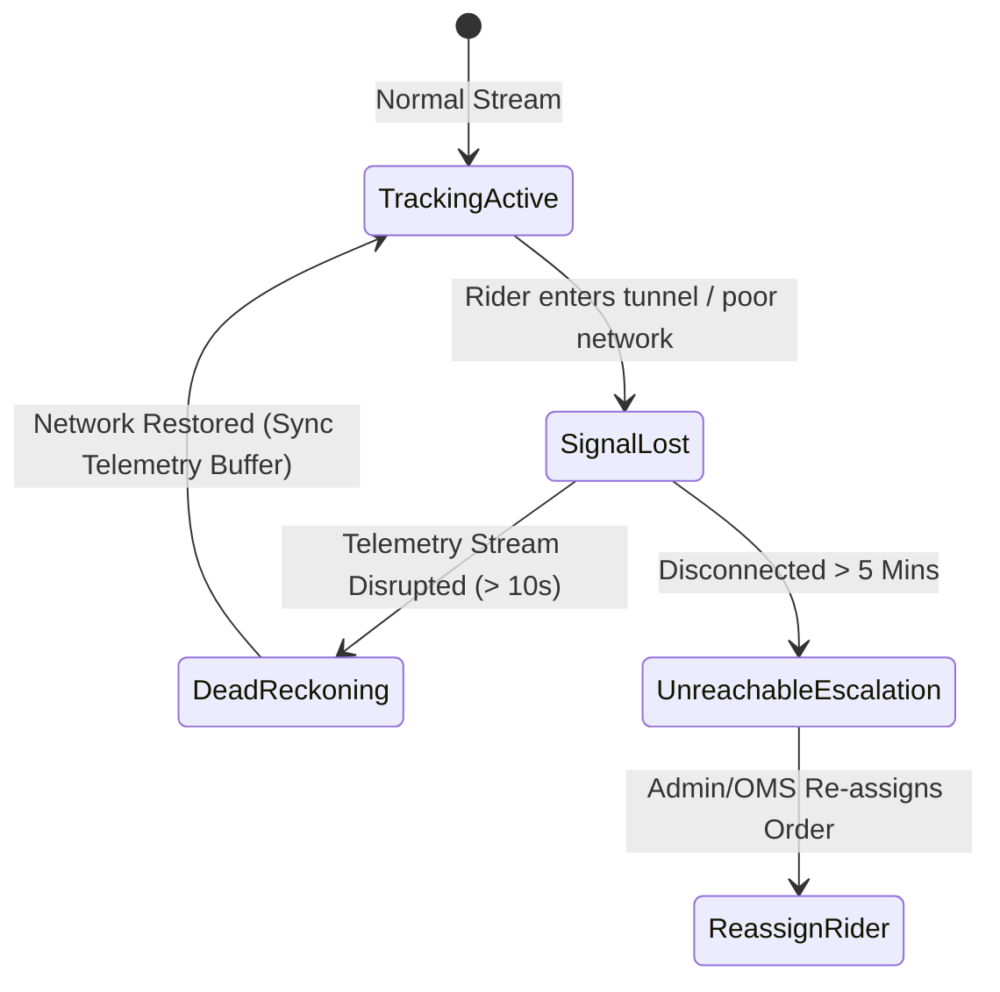

# Edge Case & Exception Handling Specification: Blinkit MVP

This document details all operational, technical, and UX edge cases for the **Blinkit Quick Commerce MVP** and specifies the exact system behaviors, mitigation strategies, and error handling fallback workflows required across all platform personas.

---

## Matrix of Edge Case Categories

---

## 1. Location & Geofencing Edge Cases

| Scenario | Trigger Condition | System Behavior & UX Resolution | Technical Implementation |
| :--- | :--- | :--- | :--- |
| **1.1 Geolocation Access Denied** | User blocks browser location permission. | Fallback to manual location picker modal with address search & pin drop. Default to primary Dark Store (*Indiranagar DS-104*). | Catch `navigator.geolocation` error code 1 (`PERMISSION_DENIED`) and trigger location selection modal. |
| **1.2 Location Outside Service Polygon** | User's pinned coordinates are > 3.0 km from nearest Dark Store. | Show **"Unserviceable Area"** banner. Disable checkout and prompt user to enter a supported pincode/area. | Perform spatial point-in-polygon query against PostGIS/GeoJSON store boundaries. Return `is_serviceable: false`. |
| **1.3 Mid-Session Address Change** | User changes delivery address after adding items to cart. | Re-calculate cart availability against newly assigned Dark Store. Flag any items out of stock in the new store. | Re-run cart validation API (`/cart/checkout`) with new `dark_store_id`. Show modal listing unavailable items to be removed. |
| **1.4 High-Rise / Gated Community Delivery** | Address is in a multi-story building or gated complex. | Prompt user for specific delivery instructions (e.g. *Gate Pass Code*, *Tower Number*, *Leave at Security Guard*). | Capture structured delivery metadata in `user_addresses` schema (`tower_number`, `gate_instructions`). |

---

## 2. Inventory & Concurrency Edge Cases

| Scenario | Trigger Condition | System Behavior & UX Resolution | Technical Implementation |
| :--- | :--- | :--- | :--- |
| **2.1 Flash Sale Concurrency (Last Unit)** | Two users attempt to purchase the final unit simultaneously. | First user gets stock lock. Second user receives `409 Conflict` modal: *"Item sold out moments ago!"*. | Use Redis `DECR` script. If result < 0, rollback decrement via `INCR` and reject request. |
| **2.2 Item Damaged/Missing During Picking** | Dark Store picker discovers item is damaged on shelf despite DB showing stock > 0. | Picker flags item as **"Damaged/Missing"** in Picker UI. System offers customer instant refund or approved substitute. | OMS emits `ORDER_ITEM_MISSING` event. Automatically adjust bill total and trigger refund sequence for missing item. |
| **2.3 Anti-Hoarding Quantity Cap** | User attempts to add > 5 units of high-demand essential items (e.g., Sugar, Milk, Oil). | Toast alert: *"Maximum 5 units allowed per order to ensure availability for all customers."* | Enforce `max_per_order` constraint on product entity during quantity stepper click and cart validation API. |
| **2.4 Near-Expiry Perishable Items** | Perishable item shelf life is < 24 hours. | Auto-apply clearance discount tag (`CLEARANCE 50% OFF`) or block dispatch if past fresh threshold. | Filter products by `created_at + shelf_life_days` in Inventory Service. |

---

## 3. Pricing, Cart & Payment Edge Cases

| Scenario | Trigger Condition | System Behavior & UX Resolution | Technical Implementation |
| :--- | :--- | :--- | :--- |
| **3.1 Dynamic Price Fluctuation Mid-Session** | Product price changes while sitting in user's active cart. | Highlight price change in cart drawer: *"Price updated from ₹40 to ₹45 by merchant"*. Prompt user confirmation. | Compare cart cached price against live DB price during `/cart/checkout`. Flag `price_mismatch`. |
| **3.2 Coupon Minimum Threshold Invalidation** | User applies coupon `SAVE100` (min ₹499), then removes an item, dropping cart to ₹420. | Coupon auto-removes with banner: *"Coupon SAVE100 removed (Cart total below ₹499)"*. Bill recalculates. | Re-evaluate coupon eligibility rules on every cart mutation event (add, remove, change qty). |
| **3.3 Payment Gateway Timeout / Pending State** | Payment gateway fails to respond within 15 seconds during checkout. | Show **"Verifying Payment..."** polling screen. Do not duplicate order. | Polling loop (max 30s) against `/api/v1/payments/{txn_id}/status`. If status remains pending, mark order `PAYMENT_PENDING`. |
| **3.4 Double Charge / Payment Deducted but Order Failed** | Money deducted from bank, but order creation failed due to network drop. | Webhook detects orphan payment and initiates instant refund within 5–10 minutes. Push notification sent. | Reconcile payment gateway webhook logs against OMS DB. Trigger automated refund service. |

---

## 4. Dark Store Operational Edge Cases

| Scenario | Trigger Condition | System Behavior & UX Resolution | Technical Implementation |
| :--- | :--- | :--- | :--- |
| **4.1 Dark Store Order Surge / High Load** | Active orders at Dark Store exceed picker capacity (> 50 unfulfilled orders). | Dynamic delivery ETA extends from **10 mins** to **20-25 mins**. Surge fee banner activated. | Monitor queue depth metric `dark_store_queue_length`. Dynamically update `eta_mins` calculation. |
| **4.2 Complete Dark Store Closure (Emergency)** | Dark Store experiences power outage or emergency closure. | Automatically switch store status to `INACTIVE`. Route incoming traffic to secondary store or mark area offline. | Admin toggle sets `dark_stores.is_active = false`. GeoRouter bypasses inactive stores. |
| **4.3 Picker Delay Threshold Exceeded** | Order picking time exceeds 180 seconds. | Escalation alert on Picker UI & Admin panel. Priority flag assigned to order. | Background cron checks `PLACED` state timestamp. Triggers `PICKER_DELAY_WARNING` event if `now - created_at > 3 mins`. |

---

## 5. Rider Fleet & Telemetry Edge Cases

| Scenario | Trigger Condition | System Behavior & UX Resolution | Technical Implementation |
| :--- | :--- | :--- | :--- |
| **5.1 No Rider Available at Dark Store** | Order is `PACKED`, but 0 riders are in `IDLE` status. | OMS places order in `DISPATCH_QUEUE`. Customer ETA updates: *"Finding nearest rider..."*. Surge pay offered to nearby riders. | Queue dispatcher retries rider matching algorithm every 10 seconds up to 3 minutes before escalating to store manager. |
| **5.2 Rider Vehicle Breakdown Mid-Transit** | Rider marks vehicle issue in Rider App. | Order automatically re-assigned to nearest idle rider. Replacement rider navigates to current location for handover. | Rider App triggers `RIDER_EMERGENCY`. OMS creates sub-task to dispatch secondary rider to coordinates. |
| **5.3 Telemetry Signal Loss / GPS Dropout** | Rider enters dead zone or battery dies mid-transit. | Map UI displays estimated position using dead-reckoning speed vector. Show badge: *"Updating live location..."*. | Client WebSocket detects dropped stream. Calculates projected position based on average speed ($20\text{ km/h}$) until reconnect. |
| **5.4 Customer Unreachable at Doorstep** | Rider arrives, rings bell/calls customer 3x with no response for 5 minutes. | Rider triggers **"Customer Unreachable"** timer (3-minute countdown). Automated IVR call sent to customer. | If timer expires, rider returns package to Dark Store. Order marked `UNDELIVERABLE` (Cancellation policy applies). |
| **5.5 Incorrect OTP Entered by Rider** | Rider enters wrong OTP on doorstep. | Error message: *"Invalid OTP. Please check customer phone screen."* Max 3 attempts allowed. | Verify hash of input OTP against `orders.delivery_otp`. After 3 failed attempts, trigger SMS OTP resend. |

---

## 6. Network, State & Browser Edge Cases

| Scenario | Trigger Condition | System Behavior & UX Resolution | Technical Implementation |
| :--- | :--- | :--- | :--- |
| **6.1 Offline / Network Loss During Browsing** | User loses internet connection while navigating app. | Non-blocking banner: *"You are offline. Showing cached catalog."* Disable checkout button. | Listen to `window.addEventListener('offline')` and `window.addEventListener('online')`. Disable action triggers. |
| **6.2 LocalStorage Corruption / Storage Cleared** | Browser storage cleared during an active order. | App restores order state from backend server using User Session / Active Order API. | On app load, query GET `/api/v1/orders/active` to re-hydrate state store independently of LocalStorage. |
| **6.3 WebSocket Connection Drop during Live Track** | Connection drops during map tracking. | UI shows smooth reconnecting spinner. Automatically falls back to HTTP polling every 4 seconds. | Implement exponential backoff reconnect logic in WebSocket manager, with fallback to GET `/orders/{id}/track`. |

---

## 7. Summary & Implementation Verification

All edge cases defined in this specification must be verified via unit tests, component boundary handling, and end-to-end user scenario testing prior to production deployment.
