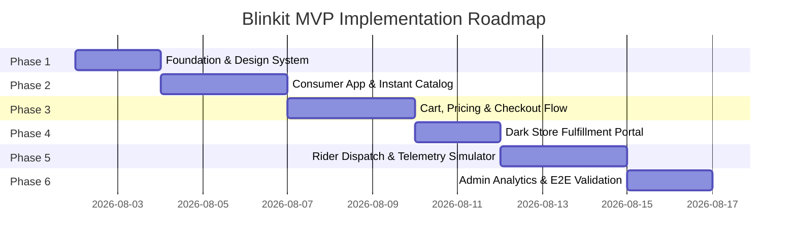

# Phase-Wise Implementation Plan: Blinkit MVP (Quick Commerce Platform)

Based on [problemstatement.md](file:///c:/Users/DELL/OneDrive/Desktop/blinkit%20MVP/DOCS/problemstatement.md) and [architecture.md](file:///c:/Users/DELL/OneDrive/Desktop/blinkit%20MVP/DOCS/architecture.md), this document details the step-by-step implementation strategy for constructing the **Blinkit Quick Commerce MVP**.

---

## Roadmap Overview



---

## Phase 1: Foundation & Core Design System Setup

### 1.1 Objectives
- Establish the modular directory structure for frontend assets, components, state management, and mock data.
- Create the core CSS design system (`styles/index.css`) containing all color tokens, typography rules, glassmorphism utilities, and responsive breakpoints.
- Build the initial mock database store with realistic quick-commerce inventory data.

### 1.2 Tasks & Deliverables
- [ ] **Directory Blueprint**:
  ```
  blinkit MVP/
  ├── index.html                  # Main Application Entry Shell
  ├── DOCS/                       # Project Documentation
  │   ├── problemstatement.md
  │   ├── architecture.md
  │   └── implementation_plan.md
  ├── src/
  │   ├── css/
  │   │   ├── index.css           # Core Design Tokens & Global Rules
  │   │   ├── components.css      # Component Component Styles
  │   │   └── views.css           # View-specific layout styles
  │   ├── js/
  │   │   ├── app.js              # Main App Initialization & Routing
  │   │   ├── store.js            # Reactive Central State Management
  │   │   ├── mockData.js         # Products, Categories, Dark Stores Data
  │   │   ├── components/         # Reusable UI Components
  │   │   │   ├── Header.js
  │   │   │   ├── Catalog.js
  │   │   │   ├── CartDrawer.js
  │   │   │   ├── OrderTracker.js
  │   │   │   ├── DarkStoreView.js
  │   │   │   └── RiderView.js
  │   │   └── utils/              # Formatters, Geolocation, Telemetry
  │   └── assets/                 # Icons, Badge Graphics, Sound Effects
  ```
- [ ] **Design Tokens Setup (`src/css/index.css`)**:
  - Implement Blinkit Green (`#0c831f`), Bright Yellow (`#f8cb46`), Express Badge Coral (`#ff5722`), Dark Mode Charcoal (`#121212`, `#1e1e1e`).
  - Configure Inter / Outfit font imports and responsive typography scale.
  - Define custom scrollbar styling, card hover shadows, and smooth micro-animations.
- [ ] **Mock Data Store (`src/js/mockData.js`)**:
  - **Categories**: Fruits & Veggies, Dairy & Bread, Cold Drinks & Juices, Snacks & Munchies, Instant Food, Cleaning Essentials, Personal Care.
  - **Products (50+ items)**: Title, Unit, MRP, Discounted Price, High-res images, Stock quantities per Dark Store, Aisle/Rack locations (e.g. `Aisle 2 - Shelf C1`).
  - **Dark Stores**: 3 simulated locations (Indiranagar DS-104, Koramangala DS-102, HSR Layout DS-108) with coordinates & polygon boundaries.
  - **Riders**: 5 simulated delivery partners with vehicle details and current status.

---

## Phase 2: Consumer Storefront & Instant Catalog Engine

### 2.1 Objectives
- Build a responsive, high-performance consumer interface for browsing products.
- Implement sub-100ms instant fuzzy search across product titles, categories, and tags.
- Display hyper-local delivery feasibility badges and location selector.

### 2.2 Tasks & Deliverables
- [ ] **Header & Location Bar**:
  - Auto-detected location widget with address switcher dropdown.
  - Dynamic **"10 MINUTES DELIVERY"** flash badge with animated clock icon.
  - Search bar input with instant search popover and clear button.
- [ ] **Category Navigation Slider**:
  - Horizontal scrollable category pill bar with icons.
  - Active state selection triggering sub-category filtering.
- [ ] **Product Catalog Grid**:
  - Product Card component:
    - Product image with zoom effect on hover.
    - Delivery time tag (`⚡ 8-10 mins`).
    - Title, Unit quantity (e.g., `500 g`, `1 L`).
    - Price display (Discounted Price + Strikethrough MRP).
    - Dynamic Add-to-Cart Button (`ADD` vs Stepper `[ - 1 + ]`).
    - Out-of-Stock overlay badge when inventory reaches 0.
- [ ] **Instant Search Engine**:
  - Client-side fuzzy matching filter algorithm executing on keyup with debounce (<100ms).
  - Search query highlighting and category grouping.

---

## Phase 3: Reactive Cart, Dynamic Pricing & Checkout Flow

### 3.1 Objectives
- Implement a reactive cart drawer that updates line items and totals seamlessly without page reloads.
- Calculate dynamic fees (delivery fee, surge fee, free delivery threshold progress).
- Build a seamless checkout modal supporting simulated payment methods.

### 3.2 Tasks & Deliverables
- [ ] **Cart Drawer (`CartDrawer.js`)**:
  - Slide-over panel overlay with background backdrop blur.
  - Cart item list with item thumbnails, title, quantity stepper, and line item total.
  - "Empty Cart" placeholder state with quick recommendation items.
- [ ] **Dynamic Bill Summary Component**:
  - **Item Total**: Sum of discounted prices.
  - **Delivery Fee**: Free if Item Total > ₹199, else ₹25.
  - **Handling & Surge Fee**: Dynamic calculation during simulated peak hours (₹5 - ₹15).
  - **Free Delivery Progress Bar**: "Add ₹45 more for FREE Delivery".
  - **Promo Code Engine**: Coupon input (e.g. `BLINKIT100` for ₹100 off, `WELCOME50` for ₹50 off).
- [ ] **Checkout Modal & Address Manager**:
  - Address selection dropdown (Home, Office, Other) with delivery instructions input ("Leave at door", "Do not ring bell").
  - Payment Method selector (UPI Apps - Google Pay / PhonePe, Cards, Wallets, Cash on Delivery).
  - "Pay & Place Order" action button with processing state spinner.
- [ ] **Stock Locking & Order Creation**:
  - Atomic stock validation against active Dark Store inventory.
  - Generation of unique Order ID (e.g., `BLK-892401`) and 4-digit Delivery OTP (e.g., `4819`).

---

## Phase 4: Dark Store Order Fulfillment Portal (Picker View)

### 4.1 Objectives
- Provide Dark Store warehouse staff with a dedicated picking and packing interface.
- Optimize pick paths using shelf/aisle location indicators to guarantee sub-2-minute order packing.

### 4.2 Tasks & Deliverables
- [ ] **Picker Dashboard (`DarkStoreView.js`)**:
  - Tab/View switcher for `Store Picker Portal`.
  - Live order feed sorted by urgency and creation timestamp.
  - Audio alert chime & flashing banner on new `PLACED` orders.
- [ ] **Pick List Checklist Component**:
  - Visual list of ordered items with product image, quantity, and exact rack coordinates (e.g., `Aisle 1 • Shelf A4`).
  - Interactive checkboxes for pickers as items are placed into the packing tote.
- [ ] **Handover & Dispatch Action**:
  - Packing audit summary verification.
  - "Pack & Handover to Rider" button updating status to `PACKED` / `DISPATCHED`.

---

## Phase 5: Rider Dispatch & Real-Time GPS Telemetry Simulator

### 5.1 Objectives
- Build a rider partner view and a live delivery tracking simulator.
- Render a live interactive map and countdown timer for the customer.

### 5.2 Tasks & Deliverables
- [ ] **Rider Partner Portal (`RiderView.js`)**:
  - Order assignment notifications with Dark Store pickup point and Customer destination address.
  - "Accept Order" and "Collected Package" action buttons.
- [ ] **Live Telemetry & Map Simulator (`OrderTracker.js`)**:
  - Interactive Map Canvas (Leaflet.js / SVG Map Simulator) showing:
    - Dark Store Marker (Origin).
    - Customer Location Marker (Destination).
    - Moving Rider Icon along the route path.
  - Real-time telemetry tick generator (updates rider position every 2–3 seconds).
  - Dynamic ETA Countdown Timer (e.g. `Arriving in 6 mins 42 secs`).
  - Rider details card (Rider Name, Photo, Vehicle Number, Call button).
- [ ] **Doorstep Delivery & OTP Verification**:
  - Customer receives 4-digit OTP on the tracking screen.
  - Rider enters OTP to confirm physical handover.
  - Order status transitions to `DELIVERED` with confetti / success animation.

---

## Phase 6: Admin Dashboard, Analytics & E2E Validation

### 6.1 Objectives
- Build an operational admin view to manage catalog pricing, stock levels, and monitor system KPIs.
- Persist state using LocalStorage for uninterrupted user testing across reloads.
- Conduct end-to-end user testing across all personas.

### 6.2 Tasks & Deliverables
- [ ] **Admin & Operations Dashboard (`AdminView.js`)**:
  - Key Performance Indicators (KPIs): Total Orders, Total Revenue, Average Delivery Time, Active Dark Stores, Active Riders.
  - Inventory Stock Management table: Quick toggles for stock quantities and instant "Out of Stock" overrides.
  - Dark Store active status and surge fee multipliers.
- [ ] **State Persistence & Reset**:
  - Automatic synchronization of cart, active orders, and inventory to `localStorage`.
  - "Reset Demo State" control in Admin view to restore initial sample data.
- [ ] **End-to-End Verification Protocol**:
  - Execute complete test flow:
    1. Consumer places order for grocery items.
    2. Dark Store picker receives alert, ticks rack items, and packs order.
    3. Rider accepts order, picks up package, and starts navigation.
    4. Consumer watches rider move live on map while ETA updates.
    5. Order completed via OTP verification.

---

## Summary of Verification Milestones

| Milestone | Target Completion Criteria | Verification Method |
| :--- | :--- | :--- |
| **M1: Design & Mock Data** | All tokens configured in `index.css`; 50+ products loaded | Visual review & store inspection |
| **M2: Catalog & Search** | Instant search filtering <100ms; category switching working | Search input response timing |
| **M3: Cart & Checkout** | Cart drawer reactive; totals & fees accurate; order created | End-to-end cart test |
| **M4: Dark Store Packing** | Order appears in Picker view; rack numbers visible; status updates | Picker flow execution |
| **M5: Live Telemetry** | Rider moves smoothly on map; ETA counts down; OTP verifies delivery | Map animation & timer sync |
| **M6: E2E Integration** | Full multi-persona loop passes without state breakage | Complete user flow walkthrough |
