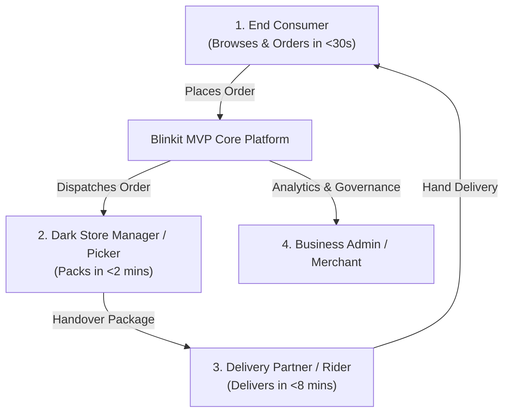

# Problem Statement: Blinkit MVP (Quick Commerce Platform)

## 1. Executive Summary
Traditional e-commerce platforms operate on standard delivery timelines ranging from 1 to 5 days. However, urban consumer behaviors in dense metropolitan areas have rapidly shifted towards immediate gratification and instant need fulfillment for everyday consumables, groceries, fresh produce, and emergency supplies.

**Blinkit MVP** aims to solve this fundamental gap by building an end-to-end, ultra-fast Quick Commerce (Q-Commerce) platform capable of delivering curated essentials to customers within **10 minutes**. The system coordinates real-time inventory management across localized micro-fulfillment hubs (Dark Stores), optimized picker packing workflows, automated rider dispatching, and dynamic live customer tracking.

---

## 2. Background & Problem Context

### 2.1 The Urban Consumer Pain Point
- **Unplanned & Emergency Needs**: Unexpected grocery stockouts during cooking, urgent baby care items, late-night snacks, or work-from-home office supplies require immediate fulfillment.
- **High Friction in Physical Errands**: Traveling to physical kirana stores or supermarkets consumes 30–60 minutes, involving traffic, parking, waiting lines, and limited store hours.
- **Traditional Delivery Delays**: Standard online grocery apps (delivering next-day or in 2-hour slots) fail for immediate meal preparation or spontaneous needs.

### 2.2 Core Operational & Technical Challenges
1. **Hyper-Local Radius Constraints**: Delivering within 10 minutes requires dark stores located within a 2–3 km radius of the customer.
2. **Ultra-Low Latency Picking & Packing**: Dark store personnel must pick, audit, and pack items in under **2 minutes** upon order placement.
3. **Real-Time Inventory Synchronization**: High order concurrency risks stockouts and overselling if inventory is not updated across channels in milliseconds.
4. **Dynamic Fleet Dispatch & Live Tracking**: Immediate assignment of nearest available rider with real-time GPS telemetry and estimated time of arrival (ETA) calculation.
5. **High Concurrency Peak Spikes**: Spikes during morning breakfast hours (7-9 AM) and evening snacks (5-8 PM) require optimized system throughput and instant search responses.

---

## 3. Target Audience & Stakeholder Personas



### Personas Summary
- **End Consumer (Buyer)**: Prioritizes speed, intuitive catalog navigation, instant search, transparent live delivery tracking, and seamless checkout.
- **Dark Store Picker/Packer**: Needs an efficient order fulfillment interface with shelf/rack location cues to minimize pick times.
- **Delivery Partner (Rider)**: Relies on turn-by-turn route mapping, batch assignment notifications, and quick status toggles (Picked, Arrived, Delivered).
- **Platform Admin / Operations Manager**: Requires real-time visibility into dark store stock levels, active orders, rider availability, fulfillment bottlenecks, and financial metrics.

---

## 4. Scope & Objectives of the MVP

### 4.1 Objectives
- **Sub-10-Minute Delivery Guarantee**: Build the digital pipeline connecting customer order placement to rider handover.
- **High Performance UI**: Deliver a visual interface with instant catalog search (<100ms response), zero-lag cart operations, and vibrant modern aesthetic styling.
- **End-to-End Workflow Simulation**: Implement full lifecycle coverage from browsing -> cart -> checkout -> dark store picking -> rider dispatch -> live GPS map tracking -> order delivery completion.

### 4.2 Core Functional Modules

#### A. Consumer Experience
- **Location Detection & Dark Store Allocation**: Auto-detect user geolocation and map to the nearest operational Dark Store (e.g., *Dark Store #104 - Indiranagar*).
- **Dynamic Product Catalog**: Multi-category view (Fruits & Vegetables, Dairy & Bread, Cold Drinks & Juices, Snacks & Munchies, Instant Food, Personal Care, Household Needs).
- **Instant Search & Auto-complete**: Fuzzy search across product names, categories, and tags with instant highlight suggestions.
- **Cart & Dynamic Pricing**: Dynamic delivery fee calculations, surge handling, threshold-based free delivery badges, and instant discount coupon codes.
- **Seamless Checkout**: Address selection, simulated multi-modal payments (UPI, Credit/Debit Card, Wallets, Cash on Delivery).
- **Live Order Tracking Hub**: Visual status progression bar with timer countdown, real-time map marker simulation, and Dark Store / Rider contact details.

#### B. Dark Store Operations Module
- Real-time order intake feed with audible/visual alerts.
- Checklist for item picking with aisle/rack numbers.
- One-click packing completion and rider allocation handoff.

#### C. Rider Fleet Module
- Active order queue for delivery partners.
- Live navigation route simulation from Dark Store to customer destination.
- OTP / Proof of Delivery confirmation flow.

#### D. Administrative & Merchant Panel
- Inventory management (add, edit, update stock, out-of-stock toggles).
- Dark store performance monitoring (avg pick time, order throughput).
- Product pricing and discount promotion management.

---

## 5. Technical Requirements & Design Standards

### 5.1 Technology Stack & Architecture
- **Frontend Core**: Modern HTML5, Vanilla JavaScript (ES6+ / React / Vite), Modular CSS with CSS Variables.
- **Design System**: High-contrast, vibrant Quick Commerce palette:
  - Primary Brand Accent: Blinkit Green (`#0c831f`)
  - Secondary Highlight: Bright Yellow (`#f8cb46`)
  - Dark Mode Surfaces: Deep Charcoal (`#121212`, `#1e1e1e`)
  - Accent Colors: Coral Orange for express delivery badges (`#ff5722`), Soft Gray card borders (`#e0e0e0`)
- **Typography**: Clean modern sans-serif fonts (e.g., Inter, Outfit, Montserrat) via Google Fonts.
- **State Management**: Reactive store pattern with LocalStorage persistence for user cart, active orders, and dark store inventory.

### 5.2 Non-Functional Requirements (NFRs)
- **Response Time**: Page load time under **1.0 second**; interactive search results rendered in **< 100 milliseconds**.
- **Mobile-First Responsive Design**: Optimized for mobile screens (360px - 430px) as well as desktop layouts (1024px+).
- **Visual Excellence**: Modern glassmorphism overlays, smooth hover effects, micro-animations for cart additions, and crisp SVG icon sets.

---

## 6. Key Data Entities & Data Model

```
+--------------------------------------------------------------------+
|                             USER                                   |
+--------------------------------------------------------------------+
| id, name, phone, email, addresses[], active_address_id              |
+--------------------------------------------------------------------+
                                 |
                                 v
+--------------------------------------------------------------------+
|                            ORDER                                   |
+--------------------------------------------------------------------+
| id, user_id, dark_store_id, rider_id, items[], total_amount,       |
| status (PLACED|PACKING|OUT_FOR_DELIVERY|DELIVERED), ETA, created_at |
+--------------------------------------------------------------------+
            |                    |                    |
            v                    v                    v
+-----------------------+ +------------------+ +---------------------+
|      DARK STORE       | |     PRODUCT      | |       RIDER         |
+-----------------------+ +------------------+ +---------------------+
| id, name, location,   | | id, title, price,| | id, name, phone,    |
| radius_km, is_active  | | unit, image,     | | vehicle_type, status|
+-----------------------+ | category_id,     | | current_location    |
                          | stock_qty        | +---------------------+
                          +------------------+
```

---

## 7. Success Criteria & Verification Metrics

| Metric | Target Goal | Verification Method |
| :--- | :--- | :--- |
| **Search Response Latency** | < 100ms | Performance benchmark on key input events |
| **Catalog Render Speed** | < 500ms initial paint | Lighthouse & Browser Performance audit |
| **Order Flow Completion** | < 30 seconds (Browse to Pay) | End-to-end user testing flow |
| **Dark Store Pick & Pack** | Simulated < 2 mins | Dark Store Operations view timestamp verification |
| **Live Delivery ETA Accuracy** | 100% simulated timer sync | Map simulation & real-time countdown progress |

---

## 8. Summary & Next Steps
This Problem Statement establishes the complete scope, functional specifications, stakeholder roles, data architecture, and visual standards required to build the **Blinkit Quick Commerce MVP**. 

Proceed to implementing the core prototype including the application foundation, design system tokens, catalog view, interactive cart, dark store order fulfillment queue, and real-time delivery tracking simulator.
